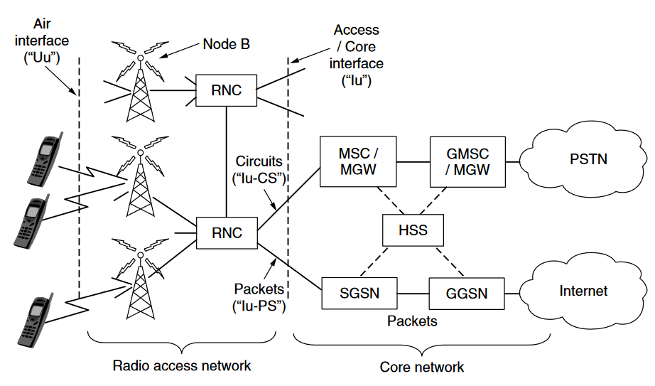

# Example Networks

 ## 1.5.1 The Internet 

### Internet 的结构

下图是 Internet 的总体结构。

## 1.5.2 3G Mobile Phone Networks

### 移动手机网络发展历史：

- <b>1G</b>：通过（连续变化的）**模拟信号**而非数字序列来传递语音信息。
  - 代表：<b>AMPS</b> (Advanced Mobile Phone System)
- <b>2G</b>：采用**数字信号**传输语音信息 (voice calls) 以及短信信息 (text messaging)
  - 代表：<b>GSM</b> (Global System for Mobile communication)
- <b>3G</b>：提供**数字**语音 (digital voice) 以及宽带数字数据服务 (broadband digital data service)
  - 代表：**UMTS** (Universal Mobile Telecommunications System ) ，也叫 **WCDMA** (Wideband Code Division Multiple Access )

### 蜂窝网络

**起因：**无线电频谱资源稀缺，移动通信运营商只能使用一定范围内的频率。当用户量越来越多，则空闲的频率会越来越少，以至于用户之间会产生频率干扰，影响通信质量。蜂窝网络设计能有效解决这种问题。

**解决方案**：在同一个蜂窝内，不同用户被分配了不同的频道，互不干扰。而且分配的频道对临接的蜂窝也不干扰（与临接的蜂窝频率不同）。这样就能做到很好的频率复用 (frequency reuse)

### 移动网络结构

下图是 UMTS 3G 移动网络的结构。

主要名词解释：

- Air Interface : 非常形象，用于移动设备与基站之间通信的无线电通信协议 (radio communication protocol)
- RNC (Radio Network Controller) : 无线网络控制器，负责控制如何使用无线电频谱 
- HSS (Home Subscriber Server) : 归属用户服务器，使用相关个人资料信息，找到在该蜂窝范围内用户的位置，以此找到对应的移动用户。

UMTS 同时支持了两种数据传输的方法："circuit " 和 "packet " 

#### <b>Related issuses</b>:

- Data services 
- Mobility 
  - handover (or handoff)
    - how to find a mobile when there is an incoming call --> HSS
- Security 
  - avoid fraud 
  - privacy 

## 1.5.3 Wireless LANs: 802.11（无线局域网）

#### **发展：**

- `802.11`是怎么来的呢：

  由规定了局域网标准的IEEE制定，承接了有线局域网标准的名字 `802.1、802.2 ... ... 802.10`

- 无线电频段选择：

  和移动网络授权的频段不同，`802.11`使用未授权的频段，例如 ISM 的频段，主要有 `2.4~2.5 GHz` 以及 `5.725~5.825 GHz`

- `802.11` 的升级换代：

  - 速率的提升：
    - 最初的版本(1997) 采用的方法是频率跳跃（可能是[跳频技术](https://baike.baidu.com/item/%E8%B7%B3%E9%A2%91%E6%8A%80%E6%9C%AF/1694433?fr=aladdin)--[FHSS](https://en.wikipedia.org/wiki/Frequency-hopping_spread_spectrum)？）或是将信号频率扩展到允许的频段上，这种方法只能达到 1~2 Mbps，因此很快被人们所抱怨。
    - `802.11b`(1999)拓展了频段范围，将速度提升至 11 Mbps。
    - `802.11a`(1999)和`802.11g`(2003)使用了一种新的策略：正交频分复用 (OFDM)，这种方法将宽频段分为一个个的小频段，然后将数据在各个小频段上并行传输。这种方法大大提升了速率，达到了 54 Mbps。
  - 解决干扰问题：
    - 采用 CSMA 方法，该种方法会在检测到其他信号发出时，按随机时间间隔推迟本机信号的发出。虽然在一些情况下，其他机器超出了本机的检测范围，可能也会导致信号的干扰。但实际上通过重新发送信号等措施，这种方法也足够有效。

  

#### **组成结构**

下图是两种结构示意图，其中第一种最为常见。

#### Related Issues

- Frequency Spectrum
- Speed 
- Signal collision 
- Mobility 
- Security 

## 1.5.4 RFID and Sensor Networks

主要介绍了原理与应用，内容比较少，可以直接看书。
