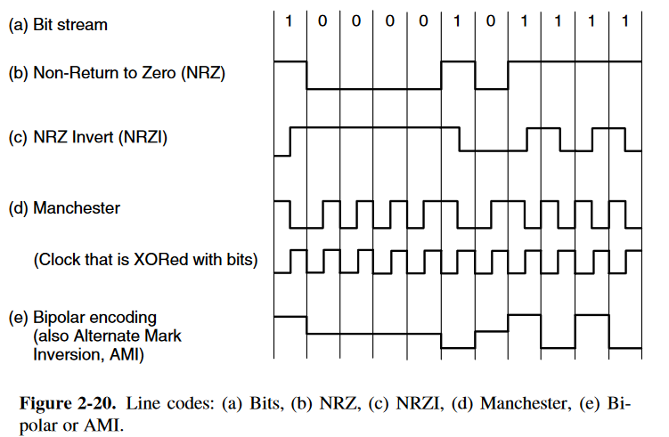
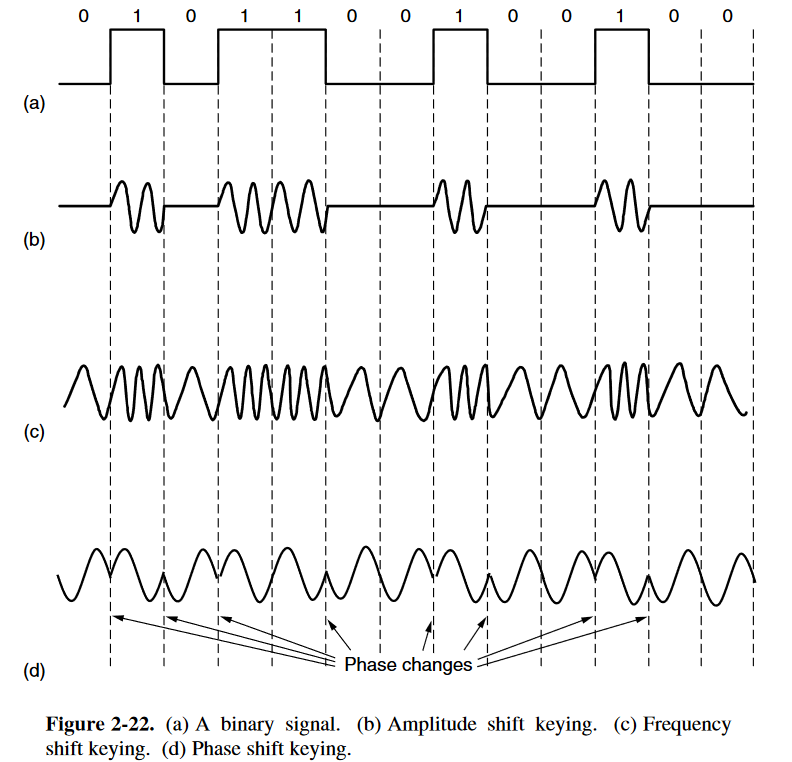
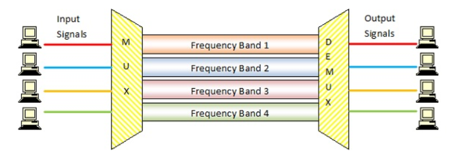
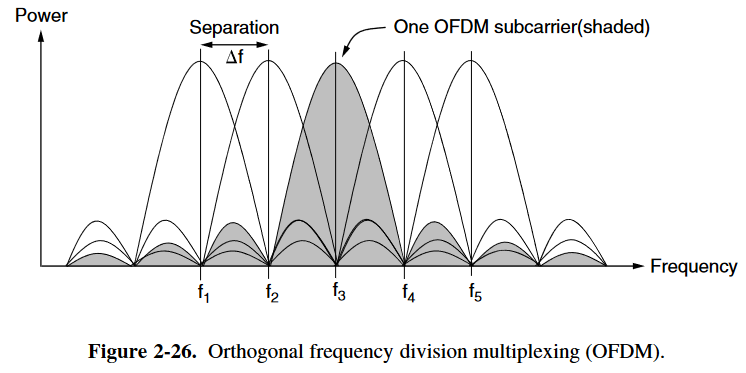
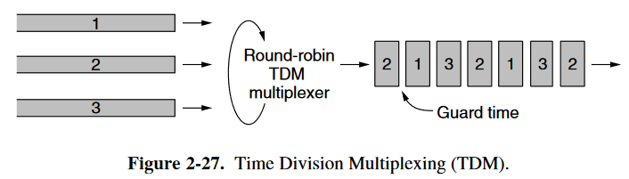

# 数字调制和多路复用

- Digital Modulation 
  - baseband transmission 
    - Bandwidth Efficiency
    - Clock Recovery
  - passband transmission 
- Multiplexing
  - FDM
  - TDM
  - CDM

## 2.5.1 基带传输(Baseband Transmission)

一些编码方法：

### 带宽效率(Bandwidth Efficiency)

对于 NRZ 编码方法，其携带的信号变化产生的信息量等级为 2 (the discreate levels which the signal contains)，因此若传输速度为 *R* bits/sec，则至少需要的带宽为 *R*/2 Hz。带宽限制了其速率。

>***R*/2 带宽怎么得到的？**
>
>由 Nyquist 定理得到，maximum data rate $R=2 B \log_2 V$ bits/sec
>
>对于NRZ， 最小带宽 $B = \frac{R}{2 \log_2 V} = \frac{R}{2 \log_2 2} = R/2$

**提高带宽效率的方法：**使用更多的信号等级 (more than 2 signaling levels)，即提高 $V$。

例如采用 4 个电压值（这种情况下 $V = 4$），这样就可以一次携带 2 bits 的信息，因此相同的传输速度所需的带宽值减半了，提高了带宽效率。

**相关术语**：

symbol rate (baud rate) : 信号变化率（波特率）

bit rate : 数据传输率，等于 信号变化率 乘以 信号携带的信息量

### 时钟恢复(Clock Recovery)

对于连续的 “0” 或者 “1” 信号，在越来越长之后，很难确定到底有多少个 “0” 或者 “1” （由于时钟的漂移导致的误差）。例如连续的15个“0”很容易被认为是16个或者是14个，而提高时钟的精度并不是一种普适的方法。**原因如下：**

- 提高时钟精度代价很贵
- 对于较慢的传输是有效的，但是对于很快的传输需要提高更高的时钟精度，因此并不普遍适用。

因此我们需要一种更**普适**方法来解决这个问题，这种方法通常称作**时钟恢复**。

**常见的方法：**

- 另外发送一个**单独的时钟信号**给接收器
  - **Manchester encoding**（缺点：与 **NRZ** 相比，要求的最低带宽变为2倍）

- 尽量让信号发生**变化**，以减少长串“0”、“1”出现
  - **NRZI** ：消除了连续的"1"造成的问题，但连续的"0"仍然会产生问题
    - 改进：**4B/5B**
      - 将数字信号按4个一组进行划分，将这4个bit数据映射为5个bit的数据，保证不会出现3个以上连续的“0”
      - 这种做法牺牲了一定的带宽效率（20%），但比**Manchester encoding**（50%）要好一些
  - <b>扰频(scrambling)</b>：使用扰频器产生一个伪随机序列，用来亦或(XORing)原来的数据，然后再用相同的方式进行解码。
    - 这种做法使原来的数据更随机一些，从概率上减少了长串“0”，“1”的出现
    - 不会减少带宽效率
    - 但运气不好时也会产生连串相同的值。比如当产生的随机序列与原来的数据完全相同时，则得到的数据全为“0”，这会严重影响信息的传输

### 平衡信号(Balanced Signals)

如果信号平均后不为0，即具有直流分量，这样的信号对于传输来说是不佳的。因为同轴电缆的物理性质会削弱直流分量，而接收器联通到信道上的电容耦合也会阻止直流分量进入。因此我们需要进行平衡信号。

- <b>bipolar encoding(AMI)</b>：“1”用 +1 V 或 -1 V 表示，"0"用 0 V 表示
  - 增加了一个信号（电压）等级
- **8B/10B**：6-bit + 4-bit (3bit -> 4bit, 5bit->6bit)
  - 对于不能平衡的，映射到两个互补的值上。如“000”映射到“1011”和“0100”上，编码器会记录不平衡性，以便下次编码时补偿。
  - 这种方式有效控制了不平衡性，至多偏移2bit
  - 同时也不会有超过5个连续的“1”和“0”，有助于**时钟恢复** 
  - 牺牲了一定的带宽效率（20%）

## 2.5.2 通带传输(Passband Transmission)

**概要：**

- 前述的信号传输能力只和带宽相关
- 信号传输不可能都在低频下进行
- 因此在传输时将频带移到高频，接受时再将其还原
- 在进行通带传输的同时，通常伴随着数字调制(Digital modulation )

**数字调制：**ASK、FSK、PSK

- 通常会将不同调制方式结合起来

- FSK 和 PSK 只能存在其中一种（因为频率和相位是相关的）
- **constellation diagram** 
  - 为了尽量减小噪音扰动造成的误差，采用格雷码（Gray code）。格雷码相关资料具体可以参考[这篇文章](https://zhuanlan.zhihu.com/p/29254973)

## 2.5.3 Frequency Division Multiplexing

将一个频带分为多个频带，每个信道使用其中一个频带。最普通的 FDM 每个频带之间设有一个隔离频带(Guard band)，以防止信道之间相互干扰。

对于`OFDM`，信道之间没有隔离频带，其采用了特殊的频域分布，使信号在其他信号的中心位置的干扰为0。因此只需采样中心位置频率的值即可。

可以参考：https://www.tutorialspoint.com/frequency-division-multiplexing

## 2.5.4 Time Division Multiplexing

将一段时间分成几段，分别分给几个信号进行传输。

STDM是根据流量统计进行分配的一种方式。

## 2.5.5 Code Division Multiplexing

一个有趣的类比：

- FDM：不同的人以不同的音调说话
- TDM：大家在一个屋子里轮流发言
- CDM：不同的人说不同的语言

具体可以看书，也可参考：https://www.tutorialspoint.com/code-division-multiplexing