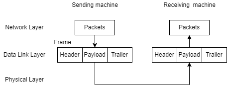

# Data link layer Design issues

设计中要考虑的问题：

- 为网络层提供定义规范的服务接口
- 解决传输过程中的错误
- 控制流量

为了解决以上的问题，链路层采用了一种手段来承载数据：**帧 (Frame)**

## 为网络层提供服务

**提供服务的流程：**

**提供的服务类型：**

- 无确认的无连接服务 (Unacknowledged connectionless service)
  - 适用于错误率较低的传输，适用于实时的通信（语音通信等），此类情况的错误检测往往会交给更高的层去处理
- 有确认的无连接服务 (Acknowledged connectionless service)
  - 适用于不可靠的信道，如无线系统（802.11等）
  - 确认功能是一种优化，而不是对数据链路层的要求
- 有确认的有连接服务 (Acknowledged connection-oriented service)
  - 最复杂的服务
  - 适用于长途的，不可靠的信道，如卫星通信，长途电话线路；这种情况下如果没有确认，可能会使同一帧发送很多次，会浪费带宽；如果不是有连接的服务，则数据的顺序可能会出现错误，这种情况下的数据延时会相当长，因此最好是采用有连接的服务