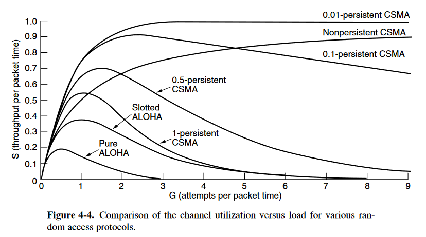
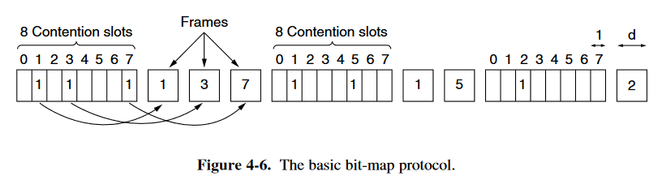
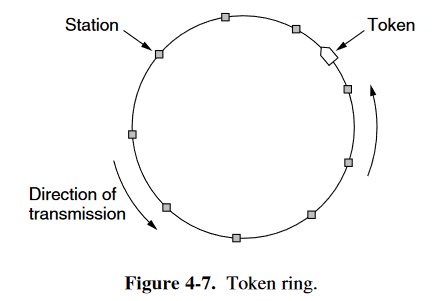
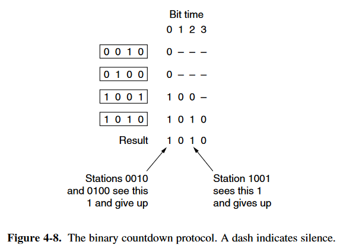
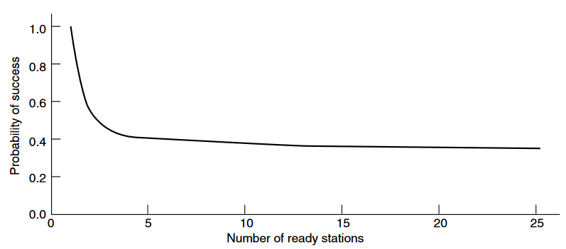
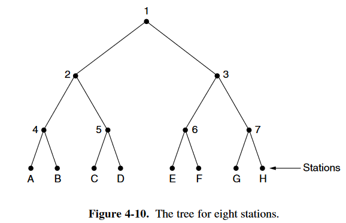
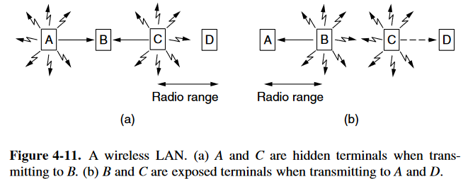
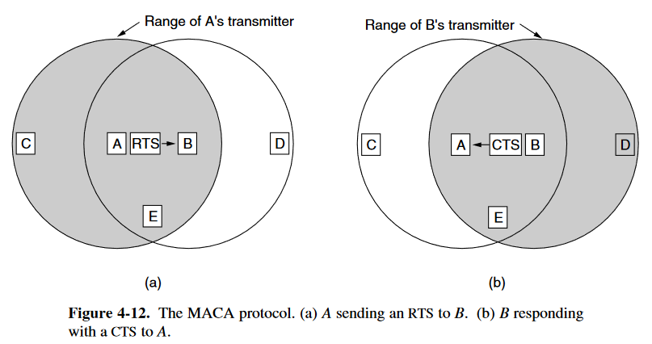

# Multiple Access Protocols

总结：

- 竞争机制 (contention protocol) ：ALOHA、(1、non、p) persistent CSMA、CSMA/CD
  - 优势：延迟小
  - 劣势：高载时，开销增大
- 预约机制 (reservation protocol)：bit-map、token-pass
  - 优势：开销固定，高载时效率高
  - 劣势：低载时，延迟大，且开销固定

## 4.2.1 ALOHA

类型:

- Pure ALOHA : 时间连续的
- slotted ALOHA ：时间分槽的

### Pure ALOHA

这种模型可以视为满足泊松分布，以下会给出一些定义：

- **frame time** : 发送一个标准的，长度固定的帧所需要的时间 (即$frame\ time = \frac{frame \ length}{bit\ rate} $)
- $N$：假设模型满足泊松分布，在一个**frame time**内发送的帧的期望值
  - 如果有$N>1$，那么几乎每一个发送出来的帧都会发生冲突，是我们不希望的，因此一般我们希望$0<N<1$
- $G$：考虑发生冲突的帧会重新发送，因此$num_{总发送帧} = num_{新发送帧} + num_{重发送帧}$；假设该模型仍然可视为满足泊松分布，则$G$为总发送帧的期望值
  - 显然应该有$G \geq N$
  - 在低负载时，发生冲突概率较小，我们可以认为$G \approx N $
  - 在高负载时，发生冲突概率较大，我们认为$G > N$
- $P_0$：发送成功概率（不发生冲突的概率）
- $S$：$S = G P_0$，即成功发送帧的数量
- **Vulnerable time**：
  - 图示如下：阴影部分的帧是被观察的对象，即发送帧，其**vulnerable time** 为 $t_0$ 至$t_0 + 2t$（即在该段时间内不能有其他的帧产生，因为会发生冲突）

由于总发送帧满足泊松分布，则在任一给定**frame time**内，产生$k$帧的概率为：
$$
Pr[k]=\frac{G^k e^{-G}}{k!}
$$
则一个**frame time**内，空闲的概率为$Pr[0]=e^{-G}$

则一个**Vulnerable time**(两个**frame time**)内，空闲的概率（即发送成功，不发生冲突的概率）为$P_0 =(Pr[0])^2 = e^{-2G}$

则可以算得成功发送帧的数量的期望值：$S = G P_0 = G e^{-2G}$

使用效率为：$\frac{S}{2G}=\frac{e^{-2G}}{2}$

> 注意在计算成功发送帧的数量的期望值时，是$G$而不是$2G$，是因为在两个**frame time**内，我们只会计划发送一个帧，因此期望为$G$
>
> 而在计算使用效率时，分母为$2G$，是因为在两个**frame time**内，可以发送的帧数为2，因此期望为$2G$

### Slotted ALOHA

Slotted ALOHA采用了分槽的时间，当站点有发送需求时，必须等到下一个时间槽开始的时刻才能发送。因此相对于 Pure ALOHA ，Slotted ALOHA的 Vulnerable Time 缩短为 t (为Pure ALOHA的一半)

因此成功发送帧的数量的期望值：$S = G P_0 = G e^{-G}$

对于给定的一帧，其发送成功概率为：$P_0 =Pr[0] = e^{-G}$

与之相对应的，冲突的概率为：$P_{collision}=1-P_0 =1-e^{-G}$

则发送次数为$k$的概率为：$P_k = e^{-G}(1-e^{-G})^{k-1}$

可以算得其发送次数的期望值为$E$：
$$
E=\Sigma^{\infin}_{k=1}kP_k = \Sigma^{\infin}_{k=1}k e^{-G}(1-e^{-G})^{k-1} = e^{G}
$$
因此，虽然 $G$ 增大时，空闲的概率会下降，但冲突的概率会指数级上升，发送次数会指数级增大。

下图展示了成功发送帧数与信道负载的关系：

## 4.2.2 Carrier Sense Multiple Access Protocols

由于ALOHA并没有检测的机制，因此其发生冲突的概率会很高，这会浪费带宽和时间。下面会介绍具有检测机制的协议。

### Persistent and Nonpersistent CSMA

- 1-persistent CSMA

  - 内容：

    当站点有数据需要发送时，其会侦听目前信道的情况

    - 如果空闲，则马上发送帧
    - 如果目前有其他站点的帧正在发送，则该站点会等待，直至信道空闲，会马上发送帧

  - 评价：

    - 发送帧太急了，容易造成冲突。
      - 例如，考虑有三个站点A，B，C。目前信道正在发送C的帧，但是在该段时间内，A和B都准备发送帧，因此在C的帧发送完成时，A与B都会同时发送帧，会导致冲突。
    - 传播延迟(Propagation Delay)也会对冲突有极大的影响
      - 例如，有两个站点A，B。A的帧刚好开始发送，但是还没有到达信道上B站点的位置，此时站点B恰好侦听，发现信道空闲，于是也开始发送帧，此时则可能会发生冲突
      - 这种冲突的机会大小通常取决于信道可以传输帧的容量，或者称为**bandwidth-delay product**。容量越大，延迟越高，则越容易发生冲突。
      - 对于绝大多数的局域网，**bandwidth-delay product**较小，因此适用于这种机制

- nonpersisten CSMA

  - 内容：

    当站点有数据需要发送时，其会侦听目前信道的情况

    - 如果空闲，则马上发送帧
    - 如果目前有其他站点的帧正在发送，则该站点会等待随机的一段时间，然后重复该检测算法

  - 评价：

    - 相比1-persistent CSMA，没那么容易引起冲突
    - 但延迟提高了

- p-persistent CSMA

  - 内容：

    当站点有数据需要发送时，其会侦听目前信道的情况

    - 如果空闲，则有p的概率发送帧，有1-p的概率推迟到下一个时间槽段，并重复算法
    - 此检测程序过程会一直重复，直到 **该帧被发出** 或者是 **其他站点开始发送帧**
      - 若是**其他站点开始发送帧**的情况，则该程序会等待一段随机的时间，然后重新开始
    - 如果一开始就检测到信道忙，则检测程序会等到下一个时间槽段，然后重复上面的检测算法

下面展示了成功发送帧数与信道负载的关系：（包括ALOHA、Persistent CSMA 以及 Nonpersistent CSMA）

### CSMA with Collision Detection

Persistent CSMA 和 Nonpersistent CSMA 可以检测出信道是否正忙，减少了冲突发生的可能，但仍然有可能发生冲突。为了尽量减少冲突发生带来的影响（浪费带宽和时间），我们需要有冲突检测的机制。通常被写为 **CSMA/CD**

这种机制的基本原理就是：站点侦听信道上的信号，若与发出的信号相同，则说明没有冲突；否则则发生了冲突。当站点知道发生冲突后，会立即停止信号继续发送，以免浪费时间和带宽。

CSMA/CD有三种状态：

- Transmission period
- Contention period
- Idle period

检测到冲突的最长时间极限为：$2\tau$（其中 $\tau$ 为信号在两个最远的站点之间的传输延迟）

因此 CSMA/CD 可以被视为是时间槽段时间为 $2 \tau $ 的 **Slotted ALOHA**

## 4.2.3 Collision-Free Protocols

CSMA/CD 虽然可以在检测到冲突时停止发送，但在Contention Peroiod期间仍会发送冲突。尤其是当 bandwidth-delay product 很大时，这种影响会很明显。下面介绍的协议即便是在Contention Peroiod期间也不会发生冲突。

### A Bit-Map Protocol

两个阶段：

- Contention period

  若有 N 个站点，则在 Contention period 期间，时间槽被分成 N 份，若在此前第 j 个站点准备发出数据，则 Contention period 期间的第 j 个时间槽内填入1。

- Transmission period

  在该阶段，按照 Contention period 期间被填入 1 的时间槽的序号顺序，发送对应序号站点的数据。这样就不会发生冲突。

如下为两个阶段的流程图：（前8个slot为 Contention period ，后面的 Frames 为对应的 Transmission period ）

工作情况分析：

- 低载：（假设一次只有一个站点需要发出数据）
  - 从站点的视角：假设一个站点准备好发送数据时，扫描进度平均在 Contention period 中点位置
    - 低序号站点：这轮扫描完成( $N/2$ slots) + 下轮整个扫描完成后($N$ slots) 才能将数据发出，因此开销为 $1.5 N $ slots
    - 高序号站点：这轮扫描完成( $N/2$ slots) 即可将数据发出
    - 因此平均下来的开销为 $N$ slots
  - 从信道的视角：效率为 $\frac{d}{d+N}$ ($d$ 为数据量，$N$ 为额外开销量)
  - 平均延迟为：$N + d$
- 高载：（假设一次每个站点都需要发出数据，且数据量平均为 $d$）
  - 从信道的视角：额外开销量 $N$ 被每个站点发出的数据量均分 ，因此效率为 $\frac{d}{d+1}$ 
  - 平均延迟为：$N+(N-1)d$

### Token Passing

Token 会轮流在每个站点之间传递，当Token传递到一个站点时，该站点被允许发送帧，在帧发送完成之后，该站点将 Token 传递到下一个站点。

额外的开销为：N 次传递 Token 的传播时间

相比于 Bit-Map Protocol 的优势：

- 由于 Token 是轮流传递的，因此对于每个站点，其额外等待的时间都是相当的，不会出现 Bit-Map Protocol 中低序号与高序号之间的等待时间不同的情况
- 协议发送数据前并不需要 Token 传递完一圈，只需要 Token 传递到下一个站点

### Binary Countdown

对于上面提到的 Bit-Map 和 Token Passing 每个站的开销都为 1 ，总的开销为 N 。如果使用二进制编码来表示每个站的地址，会进一步减小开销，此时开销仅为 $\log_2 N$。

地址高的站点可以优先发送帧

这种方法的效率为：$\frac{d}{d+\log_2 {N}}$

但如果帧被精心设计，使得二进制地址是帧的第一个字段，那么可以做到效率为100%

## 4.2.4 Limited-Contention Protocols

前面介绍的基于竞争和预约的机制在低载和高载时各有优劣，如果能将其结合起来，可以达到更好的效果，因此设计出了 **limited-Contention Protocols**。在低载时采用竞争机制，提供更小的延迟；在高载时采用无冲突的机制，以提供更高的使用效率。

对于对称的竞争情况 (即每个站点可以发送帧的机会相等，为 $p$ )，若此时想要发送数据的站点数量为 $k$， 可以得到每次成功发送（不会发生冲突的概率）为：$k p (1-p)^{k-1}$。

我们可以考察最优情况，即 $p$ 的取值恰好让该概率最大，此时 $p=1/k$，得到的概率为：$Pr[optimal \ p ] = [\frac{k-1}{k}]^{k-1}$

随着计划发送数据的站点数量 $k$ 的增加，发送成功的可能性会渐进至 $1/e$，且下降速度很快，因此我们需要尽量少的站点数量以获得更大的成功概率。下图展示了发送成功概率与计划发送数据的站点数量 $k$ 的关系：

因此我们的目标是将合理分组，将站点分到不同的组，规定一个组只能在特定的时间点进行竞争，减少每个时间槽或时间点的竞争站点的数量，以获取更高的发送成功率。

与此同时，我们希望能够动态分组。在低载时，每个组可以有许多的站点；但在高载时，每个组包含较少的站点，甚至是只包含一个站点。

### The Adaptive Tree Walk Protocol

<b>内容：</b>

- 将站点作为二叉树的结点
- 在 Slot 0 允许 结点1 下方的结点（即所有站点）发送，将该操作称为 `Trans(Node_1)`
  - 如果没有数据，说明所有站点都没有数据发送
  - 如果发送成功，则说明只有一个站点有数据需要发送
  - 如果冲突，则说明下方有两个及以上的站点需要发送数据，此时对结点2进行 `Trans(Node_2)`；完成之后再对结点3进行`Trans(Node_3)`。

该过程本质上是深度优先搜索需要发送数据的站点，因此需要将 `Trans(Node_x)`递归地执行下去，直到所有的结点都发送完成。该协议的拓扑结构如下图：

<b>优化：</b>

当负载较大时，前面的对Node 1(level 0 )，Node 2、Node 3 (level 1 )的检查都是无意义的，因此我们可以直接从指定层开始检查。

对于第 $i$ 层的结点，该结点下方的站点的数量占比为 $2^{-i}$；假设所有就绪的站点的数量为 $q$ ，则对第 $i$ 层的结点下面就绪的结点数量为：$2^{-i} q$，我们期望该值为 1。则我们开始检查的层的序号应该为：$i = \log_{2} q$

## 4.2.5 Wireless LAN Protocols

无线局域网的特点：

- 难以检测冲突的发生（由于信号的衰减），因此通常采用的是确认（Acknowledgement）的方式

- 信号传输范围有限

  - 如果采用 CSMA ，会产生以下的问题：

    - hidden terminal problem：对于同一个接收方，其不同的发送方相隔较远，不能检测到对方，因此如果同时发生数据，会产生冲突

    - exposed terminal problem：对于两个较为接近的发送方，其对应的接收方不同，如果两个发送方同时发送数据，并不会相互干扰。但按照 CSMA 的机制，这两个站点会被认为是干扰。

    - 问题的本质：

      CSMA 只能检测发送站点周围是否有活跃事件，而不能检测接收站点周围是否有活跃事件。在有线局域网中，所有站点通过一个信道进行交流，因此信号可以传输到所有站点，不存在这种问题；而在无线局域网中，站点的交流范围是有限的，这种情况下就会出现这种问题。

<b>MACA (Multiple Access with Collision Avoidance) </b>：一种早期，其影响较深的方法

内容：

- 站点需要发送数据时，会提前发送一个 **RTS (Request To Send) 帧**。范围内的非目标站点接收到后会在一段时间内停止对外发送帧，以免干扰到原站点收到回复。
- 目标站点接收到原站点的 RTS 帧后，会发出一个 **CTS (Clear To Send) 帧**。范围内的非目标站点接收到后会停止发送，以免干扰接下来的数据传输
- 原站点接收到 CTS 帧后，会发出**数据帧**。

具体过程如下图：

但是这种机制仍会发生冲突，考虑这种情况：站点 B 与 C 同时向 A 发送 RTS 帧，此时双方的 RTS 帧会发送冲突，在一定时间内未接受到 CTS 帧后，发送方站点会等待一段随机时间，然后重新发送 RTS 帧。（但是这种机制下，仅有控制帧冲突，没有数据帧冲突，减少了资源的浪费）
