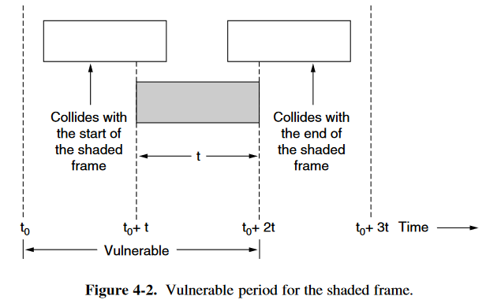
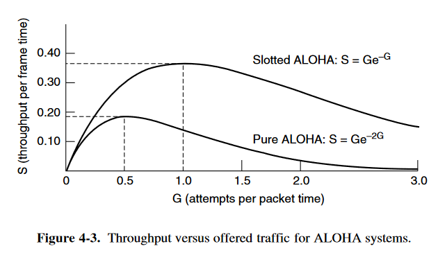

# Multiple Access Protocols

## 4.2.1 ALOHA

类型:

- Pure ALOHA : 时间连续的
- slotted ALOHA ：时间分槽的

### Pure ALOHA

这种模型可以视为满足泊松分布，以下会给出一些定义：

- **frame time** : 发送一个标准的，长度固定的帧所需要的时间 (即$frame\ time = \frac{frame \ length}{bit\ rate} $)
- $N$：假设模型满足泊松分布，在一个**frame time**内发送的帧的期望值
  - 如果有$N>1$，那么几乎每一个发送出来的帧都会发生冲突，是我们不希望的，因此一般我们希望$0<N<1$
- $G$：考虑发生冲突的帧会重新发送，因此$num_{总发送帧} = num_{新发送帧} + num_{重发送帧}$；假设该模型仍然可视为满足泊松分布，则$G$为总发送帧的期望值
  - 显然应该有$G \geq N$
  - 在低负载时，发生冲突概率较小，我们可以认为$G \approx N $
  - 在高负载时，发生冲突概率较大，我们认为$G > N$
- $P_0$：发送成功概率（不发生冲突的概率）
- $S$：$S = G P_0$，即成功发送帧的数量
- **Vulnerable time**：
  - 图示如下：阴影部分的帧是被观察的对象，即发送帧，其**vulnerable time** 为 $t_0$ 至$t_0 + 2t$（即在该段时间内不能有其他的帧产生，因为会发生冲突）

由于总发送帧满足泊松分布，则在任一给定**frame time**内，产生$k$帧的概率为：
$$
Pr[k]=\frac{G^k e^{-G}}{k!}
$$
则一个**frame time**内，空闲的概率为$Pr[0]=e^{-G}$

则一个**Vulnerable time**(两个**frame time**)内，空闲的概率（即发送成功，不发生冲突的概率）为$P_0 =(Pr[0])^2 = e^{-2G}$

则可以算得成功发送帧的数量的期望值：$S = G P_0 = G e^{-2G}$

使用效率为：$\frac{S}{2G}=\frac{e^{-2G}}{2}$

> 注意在计算成功发送帧的数量的期望值时，是$G$而不是$2G$，是因为在两个**frame time**内，我们只会计划发送一个帧，因此期望为$G$
>
> 而在计算使用效率时，分母为$2G$，是因为在两个**frame time**内，可以发送的帧数为2，因此期望为$2G$

### Slotted ALOHA

Slotted ALOHA采用了分槽的时间，当站点有发送需求时，必须等到下一个时间槽开始的时刻才能发送。因此相对于 Pure ALOHA ，Slotted ALOHA的 Vulnerable Time 缩短为 t (为Pure ALOHA的一半)

因此成功发送帧的数量的期望值：$S = G P_0 = G e^{-G}$

对于给定的一帧，其发送成功概率为：$P_0 =Pr[0] = e^{-G}$

与之相对应的，冲突的概率为：$P_{collision}=1-P_0 =1-e^{-G}$

则发送次数为$k$的概率为：$P_k = e^{-G}(1-e^{-G})^{k-1}$

可以算得其发送次数的期望值为$E$：
$$
E=\Sigma^{\infin}_{k=1}kP_k = \Sigma^{\infin}_{k=1}k e^{-G}(1-e^{-G})^{k-1} = e^{G}
$$
因此，虽然 $G$ 增大时，空闲的概率会下降，但冲突的概率会指数级上升，发送次数会指数级增大。

下图展示了成功发送帧数与信道负载的关系：

## 4.2.2 Carrier Sense Multiple Access Protocols

