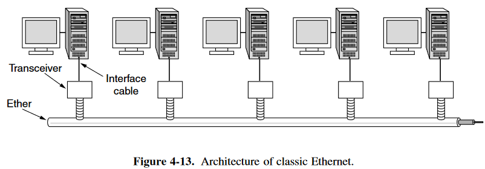
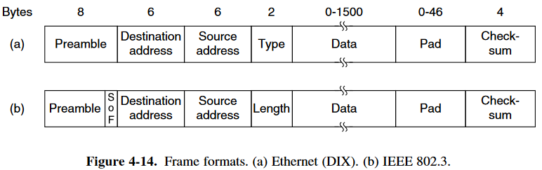
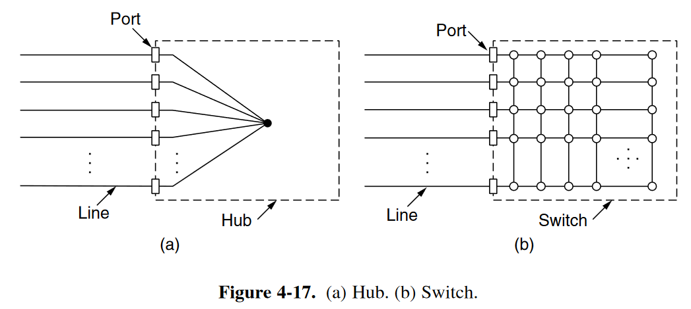

# Ethernet

两种类型：

- classic Ethernet
- switched Ethernet：由classic Ethernet发展而来，速度更快

## 4.3.1 Classic Ethernet Physical Layer

- thick ethernet
- thin ethernet

使用 Manchester encoding

## 4.3.2 Classic Ethernet MAC Sublayer Protocol

帧的结构如下图：

- Preamble
  - 前7个字节为10101010，用于同步
  - 最后一个字节是10101011，`10`仍是用于同步，最后的`11`用于说明同步结束，接下来是帧的内容；
- Two addresses
  - Destination address
    - 第一位为：
      - `0`：普通地址
      - `1`：群组地址；**multicasting**
    - 地址的位全为1：广播 (broadcasting)
  - Source address
- Type or Length Address
  - Type Address (Ethernet (DIX) )
  - Length Address (IEEE 802.3)
    - 表征该帧的长度
    - 数据如何处理则交由数据区域（Data field）内部的一个 <b>LLC header</b> 决定

- 长度有限：有最大长度限制和最小长度限制
  - 最大长度限制：主要的考量是收发器(Transceiver)需要足够的内存来存放一个完整的帧，而当时的内存非常宝贵，因此制定了该规则
  - 最小长度限制：有两个考量
    - 区分有效帧与垃圾帧：收发器检测到冲突时，会截断当前的帧。在检测到冲突前发出的数据位已经发出，一般来说这些垃圾帧的位数长度会较短，为了更好地检测出这种垃圾帧，因此这里设置了帧的最低长度。当不满最低长度时，会使用<b>Pad</b>进行补充
    - 为了避免这种错误情况（更重要的考量）：当帧太短时，可能在发出的第一位到达最远端之前就已经完成发送，这时它会以为该帧以及发送成功。但实际上若第一位还没有到达最远端，这时仍有冲突的可能，若此时发生冲突，则该帧便不会再被重新发送。
- checksum: 32位的CRC

### CSMA/CD with Binary Exponential Backoff

- 前提：
  - classic Ethernet 使用的是 1-persistent CSMA/CD
  - slot time ($2 \tau$) 根据Ethernet的最长路径限制，slot time 被设定为 $51.2\  \rm{\mu sec} $
  - 发生冲突后的随机等待时间的设置很重要，太短可能会导致一直冲突，太长时间效率低。
- 随机等待时间的设置方案：
  - 在第 $i$ 次冲突后，选择时间段为 $0$  至 $2^{i}-1$ 中的一个 slot time 进行发送。
  - 在发生10次冲突后，时间段的最大值为维持为1023。
  - 在发生16次冲突后，会将其错误报告给终端，交由更高层的协议进行恢复处理。

## 4.3.3 Ethernet Performance

- 前提：

  - Binary exponential backoff 的代价计算过于麻烦，不考虑
  - 假设每个 slot 都有一个固定的重新发送概率 $p$

- 表现：

  - 竞争需要的时间槽数的期望值为：$\Sigma_{j=0}^{\infin}jA(1-A)^{j-1} = \frac{1}{A}$

  - $P$ 为数据帧传输的平均时间，则效率为：$\frac{P}{P+2\tau /A}$

  - 另一种形式：（帧长度$F$，网络带宽$B$，线缆长度$L$，信号传播速度$c$，最优情况下的时间槽时间$e$）

    则可以表示为：$\frac{1}{1+2BLe/cF}$

## 4.3.4 Switched Ethernet

- 传统以太网的发展：
  - <b>Hub</b>：
    - 优势：
      - 容易维护，当连接失败时，可以方便的知道哪里的线路出现问题
      - 单独线路出现问题不会影响其他的端口
    - 不足：
      - 并不会增加带宽容量
      - 所有的站点都处于同一冲突域（collision domain）下
  - <b>Switch</b>：
    - 优势：
      - 容易维护
      - 增加了带宽
      - 安全，端口到端口的通信不会被其他端口获取
      - 每个端口具有独立的冲突域
      - 多个帧可以在交换机内同时传输
        - 若是需要被传输到同一端口，则需要缓冲区进行缓存

## 4.3.5 Fast Ethernet

(^_^)

## 4.3.6 Gigabit Ethernet

(=_=)

## 4.3.7 10-Gigabit Ethernet

(@_@)

## 4.3.8 Retrospective on Ethernet

(~_~)
