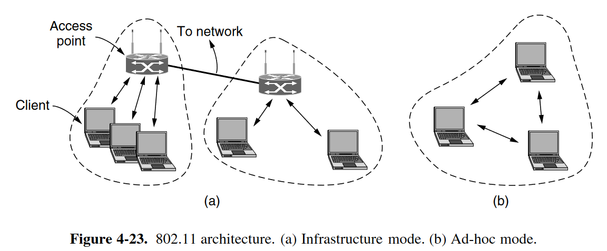
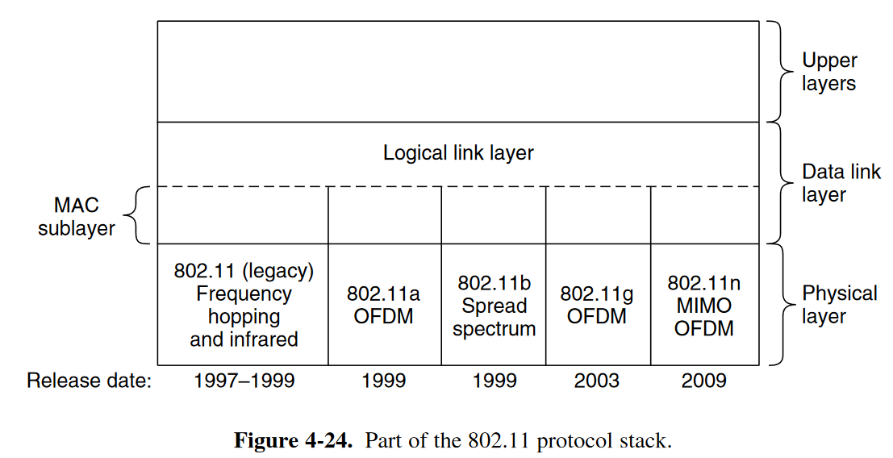

# Wireless LANs

主要内容：

- protocol stack
- physical-layer radio transmission techniques
- MAC sublayer protocol
- frame structure
- services

## 4.4.1 The 802.11 Architecture and Protocol Stack

- 结构：

  

- Protocol Stack：

  

## 4.4.2 The 802.11 Physical Layer

