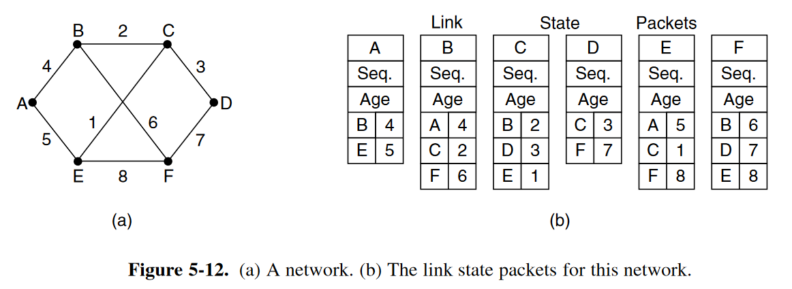

# Routing algorithm

- decide which output line(Software part)
- distinction between "routing" and "forwarding"
- desired properties:
  - correctness
  - simplicity
  - robustness
  - stability:a stable algorithm should quickly reaches equilibrium and stays there
  - fairness and efficiency(tradeoff)
    - what is we seek to optimize:
      - mean packet delay
      - total network throughput
      - overall hops
- nonadaptive algorithm (static routing) and adaptive algorithm (dynamic routing)
- discussion in this section is mainly based on topology

## 5.2.1 The optimiality principle

如果从源点S到终点T有一条最短路径，该路径途径点A和B，则该段子路径是A到B的最短路径。

构造`sink tree`

## 5.2.2 Shortest Path algorithm

- Dijkstra Algorithm

## 5.2.3 Flooding
类似洪水一样，会途径可以经过的每一条路线，如果不考虑许多数据包发送带来的开销，可以最快地到达目的位置，因为会经过每一种可能的路线。

- `hop counter`：用于限制，让一次flooding不可能一直传递下去。
- `sequence number`：用于进一步限制flooding的规模。当一个packet到达一个路由器时，如果该路由器记录过相同的sequence number，则该路由器就不会转发该packet。

## 5.2.4 Distance Vector routing

- metric: hops, propagation delay...
- 路由表：

  | `d` | `R[d].link` | `R[d].cost` | `R[d].time` |
- The Count-to-Infinity Problem（坏消息传得慢）：这个特质导致距离向量路由算法收敛很慢，尤其是当网络的拓扑结构改变时。其命名原因是：cost会一次一次地加一（也就是count的意思），直到无穷大（取决于设定的无穷大的值）
  - 描述：如果有三个路由器，a,b,c。其拓扑结构为：`c-a-b`，a与b之间的link出现问题，则拓扑结构变为`c-a-/-b`。如果此时a还没有来得及发出自己的距离向量信息，c首先发出了自己的距离向量信息<c:0,a:1,b:2>，那么a会认为可以通过c到达b，于是更新自己的路由表为<a:0,c:1,b:3>，并把距离向量发送给c，由于对c来说，`a-c`是原来达到b的最佳路由，因此会更新路由表为<c:0,a:1,b:4>，此时就造成了count to Infinity问题，之后a会把发给b的packet发给c，而c又会把发给b的packet发给a。
  - 原因：a从c得到的路由信息实际上是c从a得到路由信息。
  - 一种解决方案(`split horizon`)：针对每一个邻接结点，发送单独的距离向量，其中不包含由途径该结点的路由信息。伪代码如下：
  ```
  # split horizon
  Every N seconds:
      # one vector for each interface
      for l in interfaces:
          v = Vector()
          for d in R[]:
              if (R[d].link != l):
                  v = v + Pair(d, R[d].cost)
          send(v, l)
          # end for d in R[]
      # end for l in interfaces
  ```

参考电子书[Computer Networking: Principles, Protocols and Practice](https://beta.computer-networking.info/syllabus/default/principles/network.html#the-control-plane)，路由表更新的时机：
> - the cost of the new route is smaller than the cost of the already known route ((V[d].cost + l.cost) < R[d].cost)
> - the new route was learned over the same link as the current best route towards this destination (R[d].link == l)

The second condition is used to take into account the changes of routes that may occur after a link failure or a change of the metric associated to a link.

也就是说当发生link failure之类的事情后，最佳路由可能发生了改变，若原来最佳路由A的cost为C_1，现在A的cost为C_2，有C_2>C_1；现在的最佳路由变为B，其cost为C_3，显然有C_2>C_3。如果C_3>C_1，则路由器中的路由表不会改变，仍然会按照路由A进行，但实际上现在路由A的cost更高。因此此时就需要即时更新路由A的cost，第二条规则就是在对原有最佳路由的cost进行更新。


## 5.2.5 Link state Routing

>关于Link state routing的内容，还可以参考[这篇博客](https://www.computer-networking.info/principles/linkstate.html)，里面的叙述较为详细。

> 同时，更多关于网络的知识可以参考电子书[Computer Networking : Principles, Protocols and Practice, third edition](https://beta.computer-networking.info/syllabus/default/index.html)

- five parts：
  - Dicover its neighbors and learn their network addresses
  - Set the distance or cost metric to each of its neighbors
  - construct a packet telling all it has just learned
  - send this packet to and receive packets from all other routers
  - compute the shortest path to every other routers
- details about five parts:
  - 1.learn about the neighbors:
    - send `HELLO` packets
    - 对于有多个路由器一同连接的局域网，将该局域网抽象为一个结点，该节点再分别连接这些路由器；实际上，这个点对应的是局域网中指定的一个路由器
  - 2.Setting Link Costs:
    - a common choice: 让costs与链接的带宽成反比
      - 如果在地理位置上很分散，即每个链接的延迟差异较大，则需要主要考虑延迟，这时候就可以发送ECHO packet 来测算延迟时间
  - 3.Building Link State Packets:
    - packet的内容：
    - 更新状态，发送link state packet的时机：
      - 可以周期性更新发送
      - 也可以当有重要事件发生时发送，例如某台路由器停机或是工作状态发生显著改变
  - 4.Distributing the Link State Packets:
    - 重要性：所有的路由器需要快速，可靠地得到所有链接的信息。否则，由于路由器间掌握的链接信息的不一致，可能会出现loops, unreachable machines等问题
    - 基本思路：使用flooding
      - 一些问题：
        - 1. sequence number wrap around <mark>--></mark> 采用32bit的序列号，每1秒发送一次，需要大概137年该能循环完。  
        - 2. 如果一个路由器崩溃了，那么当它再次恢复时，它发出的LSP(Link State Packet)的序列号会从0开始，其他路由器的LSPD(Link State Packet Database)中记录的序号肯定是高于0的，因此会被错误地认为是以前的LSP，从而该网络再也不能接收到该路由器的LSP。 <mark>--></mark> 采用`age field`，每个路由器的LSPD中储存的LSP信息均有age，通常每秒-1，直至达到0，就抛弃该LSP信息。
        - 3.sequence number corruption <mark>--></mark> 采用checksum来进行维护。
      - some refinement:
        - LSP到达一个路由器后，不会立即转发，会短暂地在holding area停留，看是否会有来自同一源路由器的新LSP，以避免频繁地更新带来的路由不收敛问题
        - 每个LSP都需要确认（send和ack编号示例）
  - 5.Computing the New Routes
  - 缺点：需要的内存空间大，计算量大；not roboust.
  - 优点：不会出现距离向量路由的慢收敛问题

## 5.2.6 Hierarchical Routing
 - 使用的原因，减少内存的消耗
 - 带来的不利影响：对于某些路由器而言，采用层次路由后并不能选用最佳路由
 - 分层的依据：对于N个路由器，最佳的层数是 $\ln{N}$

## 5.2.7 Broadcast Routing
- 一些方法：
  - 最简单的：就是让源路由器把packet一个个地分别发送给其他所有的路由器
  - 改进：multidestination routing：每个packet都包含有所有的终端路由器的地址列表或者是比特映射图(bit map)，当中间路由器收到后，会根据终端地址来选择启用哪些端口，然后复制该packet送往每个端口。
  - Flooding
  - reverse path forwarding:如果一个广播的packet到达一个路由器，该路由器会查看是否是来自于源路由器到该路由器最优路径上的。如果是，说明该packet极可能首次到达该路由器，不用舍弃，然后将该packet转发到其他的路径上去；如果不是，那么该packet很有可能之前就已经到达过该路由器了，于是舍弃。
    - 该方法根据sink tree来实现，对路由器来说，可以不用记录packet。
    - 该方法适用于每个路由器都能构建完整的sink tree，例如link state routing；而对于distance Vector routing则不适用

## 5.2.8 Multicasting routing
